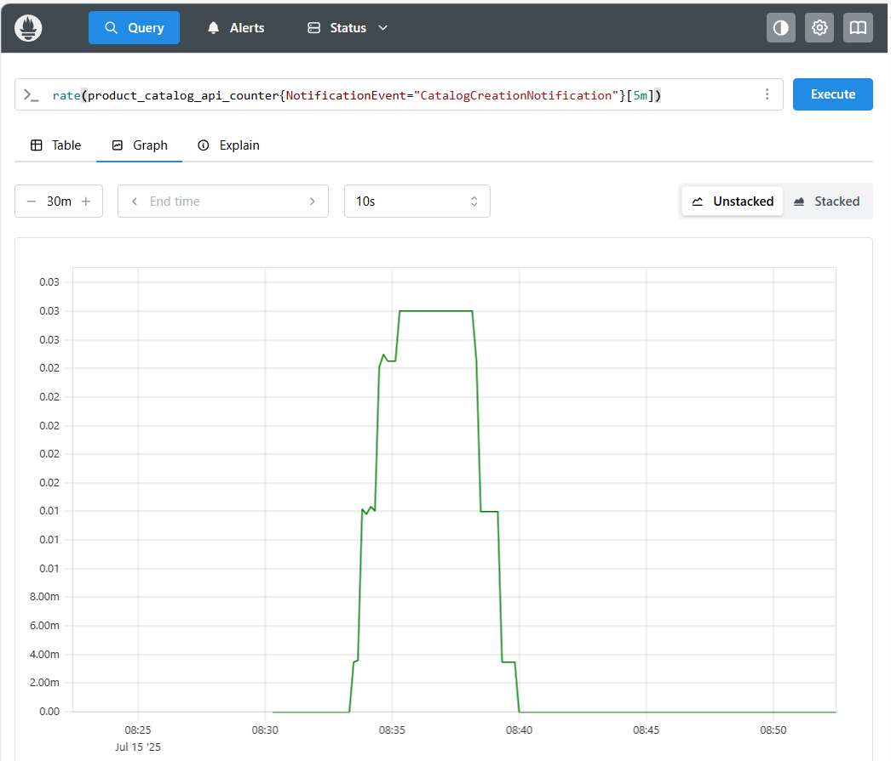

# Example Product Catalog component

This is an example implementation of a [TM Forum Product Catalog Management](https://www.tmforum.org/oda/directory/components-map/core-commerce-management/TMFC001) component.

This folder is the Helm Chart package which you distribute or host in a Helm Chart Repository. This README describes the functionality of the Product Catalog component. The source code is available at [../source/ProductCatalog](/source/ProductCatalog/). The source file readme contains all the implementation documentation.

## Functionality

### Core function

In its **core function** it implements:
* The *mandatory* TMF620 Product Catalog Management Open API. 
* The *optional* TMF671 Promotion Management Open API.
* the *optional* dependency on one or more downstream TMF620 Product Catalog Management Open APIs to support federated product catalog scenarios.

The dependency is not installed by default. To install it, set `component.dependentAPIs.enabled=true`:

```
helm install <release name> oda-components/productcatalog --set component.dependentAPIs.enabled=true -n components
```

The Product Catalog component includes an experimental Model Context Protocol (MCP) server that exposes the Product Catalog API as a *tool* towards an AI Agent. 

By default, this feature is not enabled. You can enable it by setting `component.MCPServer.enabled=true`:

```
helm install <release name> oda-components/productcatalog --set component.MCPServer.enabled=true -n components
```

### Management function

In its **management function** it implements:
* Am *optional* metrics API supporting the open metrics standard (formerly the prometheus de-facto standard). This metrics endpoint provides business metrics about all the Create/Update/Delete events for all the Product Catalog resources (Catalog, Category, Product Offering, Product Offering Price, Product Specification).

The reference Canvas includes a Prometheus observability service that can scrape the metrics API and report on these business events. For example the screenshot below shows a graph of the rate of Catalog Create events with the query `rate(product_catalog_api_counter{NotificationEvent="CatalogCreationNotification"}[5m])`. 




* Outbound Open Telemetry events. The component also generates Open-Telemetry events that can either be logged to the console using `otlp.console.enabled:true` or sent to an Open-Telemetry protobuffCollector. You can set this in the `values.yaml` file as follows:

```
  otlp:
    console:
      enabled: false
    protobuffCollector:
      enabled: true
      url: http://otel-collector.monitoring.svc.cluster.local:4318/v1/traces
```


## Security function

In its **security function** it implements:
* The *optional* TMF672 User Roles and Permissions or the TMF669 Party Role Management Open API for dynamically managed roles. The default is to use TMF672 (TMF669 will be deprecated in the future). The API to use is set in the values file `permissionspec.enabled=true`.


The implementation consists of 8 microservices:
* a role management microservice that implements either the TMF672 User Roles and Permissions API (default) or the TMF669 Party Role Management Open API (to be deprecated).
* roleInitialization microservice that bootstraps the initial PermissionSpecificationSet/PartyRole. This is deployed as a Kubernetes Job that runs once when the component is initialised.
* a productCatalog microservice to implement the TMF620 Product Catalog Management Open API.
* a promotionManagement microservice to implement the TMF671 Promotion Management Open API.
* a openMetrics microservice that implements the open metrics API.
* a productCatalogInitialization microservice that registers the metrics microservice as a listener for product catalog create/update/delete business events.  This is depoyed as a Kubernetes Job that runs once when the component is initialised.
* a simple deployment of a mongoDb. This is deployed as a Kubernetes Deployment with a PersistentVolumeClaim.
* a ProductCatalog MCP microservice that provides a Model Context Protocol (MCP) wrapper on top of the TMF620 Product Catalog Management API.


This reference component is intended to be used as a showcase for the ODA Component model, and to be used for testing the ODA Canvas. It is not intended for production deployments.


## Installation

Install this component (assuming the kubectl config is connected to a Kubernetes cluster with an operational ODA Canvas) using:
```
helm install r1 .\productcatalog -n components
```

You can test the component has deployed successfully using
```
kubectl get components -n components
```

You should get an output like 
```
NAME                          DEPLOYMENT_STATUS
r1-productcatalogmanagement   Complete
```

(The DEPLOYMENT_STATUS will cycle through a number of interim states as part of the deployment). 
If the deployment fails, refer to the [Troubleshooting-Guide](https://github.com/tmforum-oda/oda-ca-docs/tree/master/Troubleshooting-Guide).

 
## Configuration
You can configure the following aspects of the component:
- OpenTelemetry tracing and metrics
  - Any OTL endpoint with HTTP traces will do. This has been tested using Prometheus and DataDog.
- MongoDB Database connection

You can do that  by changing the values in the values.yaml file, or by setting the values on the command line when you install the component using the --set parameter.

relevant variables:

| Variable Name    	                           | Default                          	                               | Explanation                                                                                	                                                                                                  |
|----------------------------------------------|------------------------------------------------------------------|-----------------------------------------------------------------------------------------------------------------------------------------------------------------------------------------------|
| `mongodb.port`     	                         | 27017                            	                               | the port to connect to the mongodb instance the Host will be derived from the Release name 	                                                                                                  |
| `mongodb.database` 	                           | tmf                              	                               | the database name to connect to the mongodb instance                                       	                                                                                                  |
| `api.image`        	                           | csotiriou/productcatalogapi:0.10 	                               | The image for the implementation of the main api microservice                              	                                                                                                  |
| `api.otlp.console.enabled`        	            | false 	                                                          | Whether OpenTelemetry traces will be recorded in the console instead of being sent to the collector                              	                                                            |
| `api.otlp.protobuffCollector.enabled`        	 | true 	                                                           | Whether OpenTelemetry traces will be recorded in the OTL Collector instead of the console. Does not work if `api.otlp.console.enabled` is `true`                                              |
| `api.otlp.protobuffCollector.url`        	     | http://datadog-agent.default.svc.cluster.local:4318/v1/traces 	  | The host of the OTL Collector. Only used if `api.otlp.protobuffCollector.enabled` is `true`. By default it's set to the url of the collector. However, any OTL collector endpoint will suffice |
| `partyrole.image`        	                     | The image for the implementation of the partyrole microservice 	 | |

Note that in the above configuration, MongoDB configuration is shared among the partyrole and the main microservice. The host of the MongoDB database is set automatically, since it depends on the release name (it's being installed along the rest of the microservices inside the cluster).
