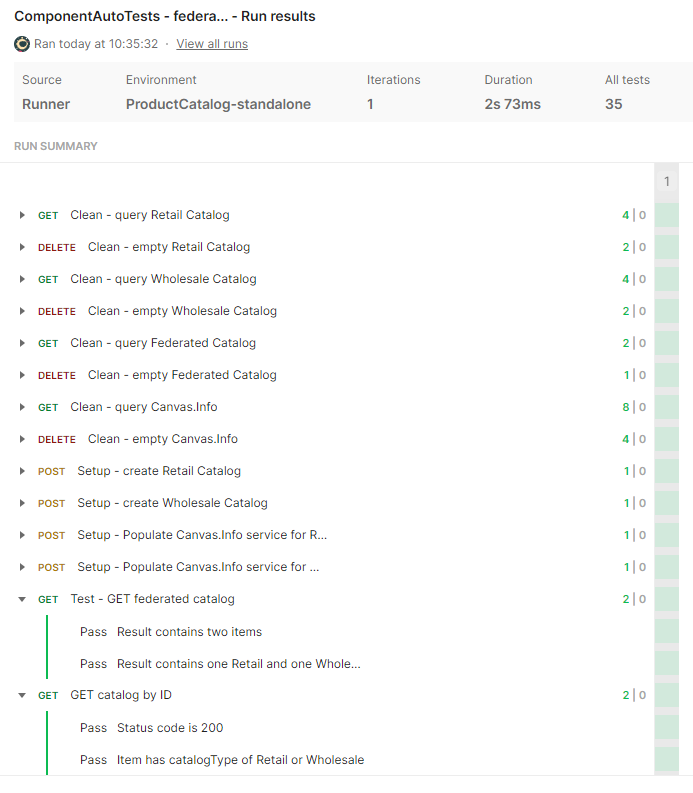

# Postman collections to test the Product Catalog Component

Here is a sample postman collection to test the Product Catalog Component.
These can be used to test the code as a standalone software running on the command-line, or as a deployed component running in an ODA Canvas. You need to create an environment in Postman declaring the {{Hostname}}. 
* For testing standalone, this will typically be `localhost:8080`.
* For testing in an ODA Canvas you need to query the API_ENDPOINT on the r1-productcatalog-productcatalogmanagement API resource - just use the first part of the URL with the hostname.

If you have applied API Keys or other authentication tokens in your deployment, you will need to add these in the headders in the postman collection.

There are three test colections for the Product Catalog Management:
* Functional test of the Product Catalog API
* Bulk deletion from the Product Catalog API
* Testing the role and event listeners

And one test collection for the Promotion Management.


# Testing the dependent API implementation

The product catalog implements the optional dependency on other Product Catalogs. It federates any resources from downstream catalogs for both retrieve by ID and list operations. It does not allow any updates to the downstream product catalogs. The product catalog microservice queries a Canvas.Info API service to get details of the downstream APIs.

For standalone testing of the Canvas.Info service, there is a standalone Nodejs implementation of the Service Inventory Open API. To execute this as standalone, execute `npm start` in the `standalone-canvas-info-service` folder.

## Test setup for standalone dependent API testing

* Create 2 downstream product catalogs by deploying two instances of the Product Catalog component:

```
helm install cat-1 oda-components/productcatalog -n components
helm install cat-2 oda-components/productcatalog -n components
```


* In a separate terminal, start the Canvas.Info service:

```
cd standalone-canvas-info-service
npm start
```

* Execute the Product Catalog code in nodejs:

```
cd productCatalogMicroservice/implementation
npm start
```

* Open the ` federating multiple product catalogs` Postman collection. This includes operations for cleaning the product catalogs and Canvas.Info service inventory (ensuring they are empyty at the beginning of the test), Populting two downstream catalogs with test data, populating the Canvas.Info service inventory with references to the two downstream APIs and then testing the correct data is listed and retrieved. The test execution should look like:



